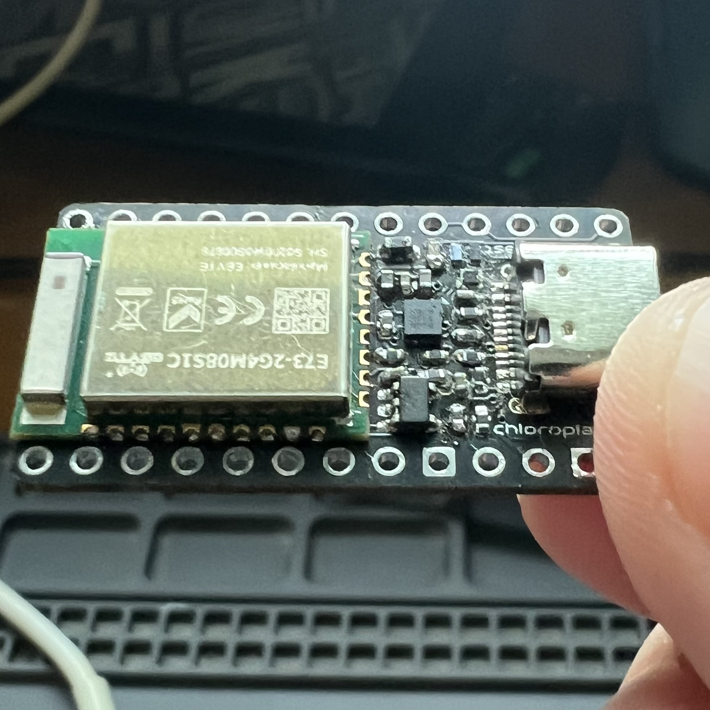
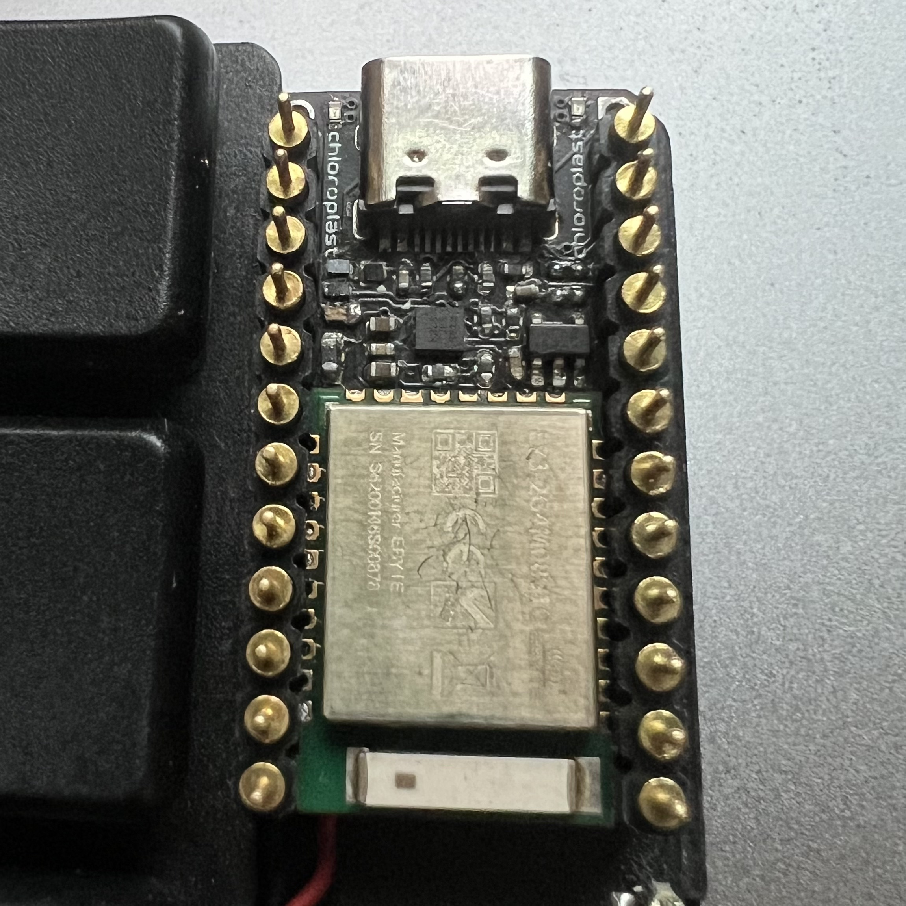
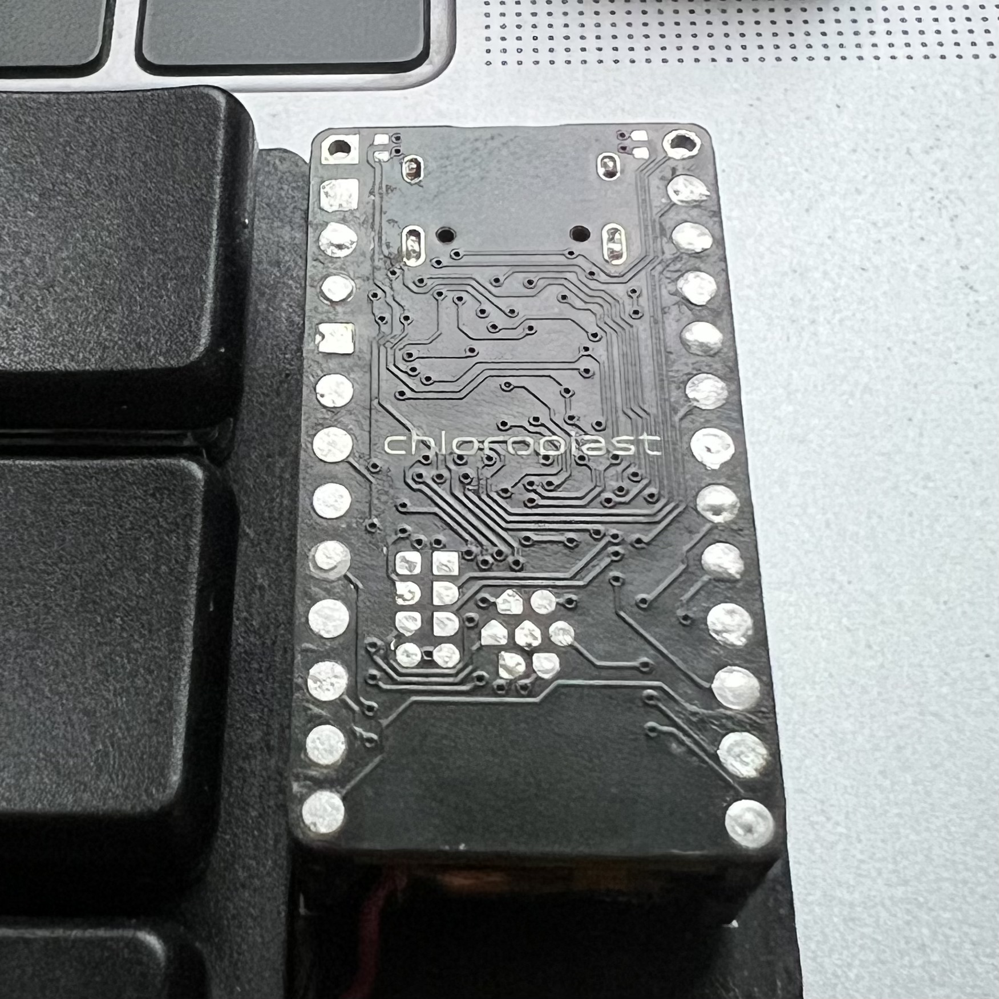
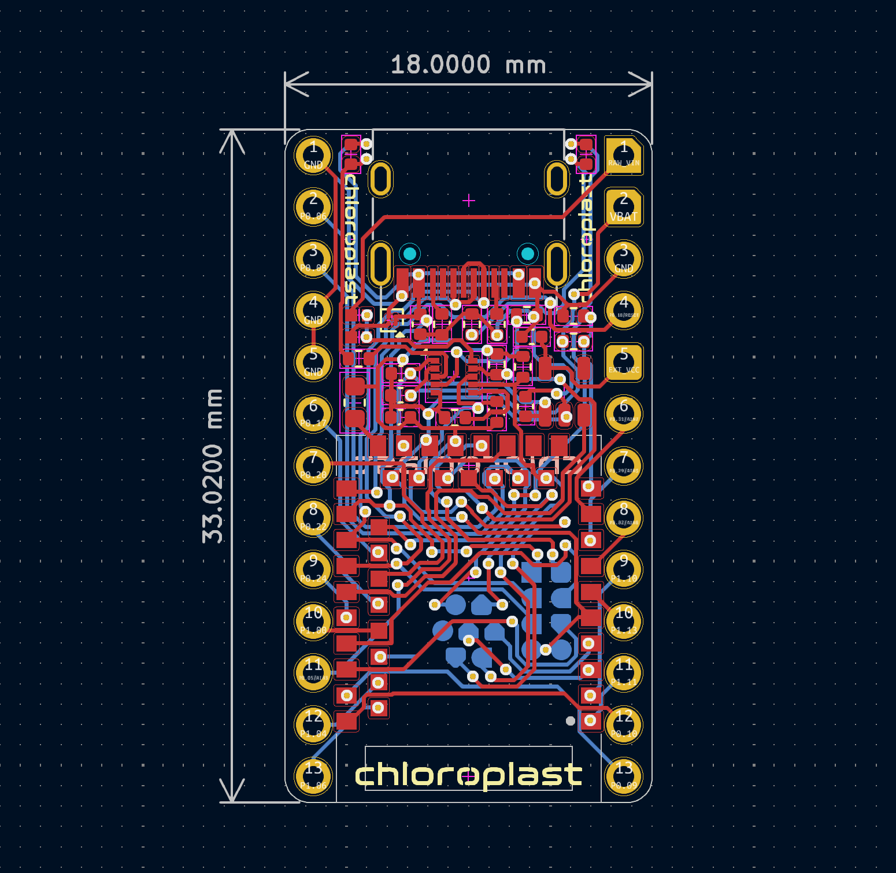
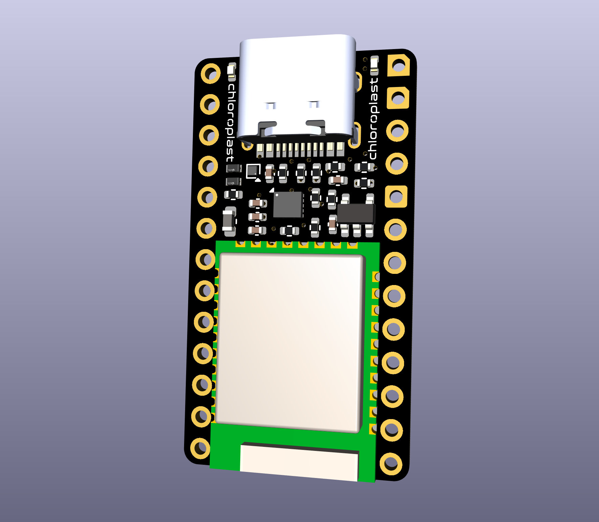
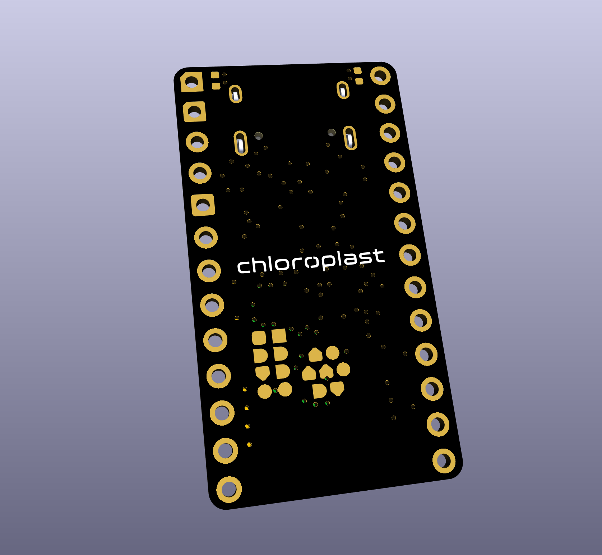
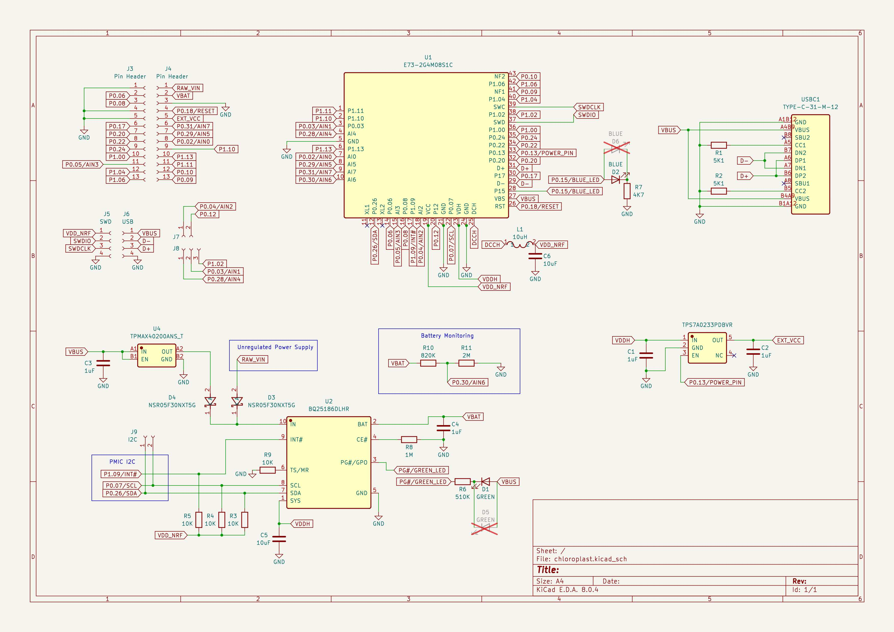

# chloroplast

A nRF52840 controller with the [Ebyte E73-2G4M08S1C module](https://www.cdebyte.com/products/E73-2G4M08S1C), [TI BQ25186DLHR](https://www.ti.com/product/BQ25186/part-details/BQ25186DLHR), and [TI TPS7A0233PDBVR](https://www.ti.com/product/TPS7A02/part-details/TPS7A0233PDBVR).

## PCB

Online preview avaliable [here](https://kicanvas.org/?github=https%3A%2F%2Fgithub.com%2Fbadjeff%2Fchloroplast-pcb), powered by [KiCanvas](https://github.com/theacodes/kicanvas).

*Figure 1: PCB edgecuts dimension*

*Figure 2: PCB 3D View - 1.0mm FR4*

*Figure 3: Schematic*

### BOM

|Designator|Footprint|Quantity|Value|LCSC Part #|
|-|-|-|-|-|
|C1,C2,C3,C4|0402|4|1uF|C52923|
|C5,C6|0402|2|10uF|C15525|
|D1|0402|1|GREEN LED|C20608784|
|D2|0402|1|BLUE LED|C434447|
|D3,D4|0402|2|NSR05F30NXT5G|C604339|
|L1|0603|1|10uH|C109083|
|R1,R2|0402|2|5K1|C25905|
|R3,R4,R5,R9|0402|4|10K|C25744|
|R6|0402|1|510K|C11616|
|R7|0402|1|4K7|C25900|
|R8|0402|1|1M|C2909328|
|R10|0402|1|820K|C2909386|
|R11|0402|1|2M|C2930015|
|U1|E73-2G4M08S1C|1|E73-2G4M08S1C|C356849|
|U2|DFN-10_2x2mm_P0.4mm|1|BQ25186DLHR|C44639442|
|U3|SOT-23-5|1|TPS7A0233PDBVR|C2887324|
|U4|WLCSP-4L|1|TPMAX40200ANS_T|C47117620|
|USBC1|USB_C_Receptacle|1|TYPE-C-31-M-12|C165948|

- SMD 0402 (Imperial) aka 1005 Metric.
- Alternative LED pads (D5,D6) are layouted on back.

### Board Characteristics

- Copper layer count: 2
- Board thickness: 1.0 mm
- Board overall dimensions: 18.0 x 33.02 mm

### Bootloader

This board uses Adafruit Bootloader. The board folder could be found at [here](https://github.com/adafruit/Adafruit_nRF52_Bootloader/compare/master...badjeff:Adafruit_nRF52_Bootloader:master). Bootloader flashing is recommended to follow the comprehensive guide on [joric/nrfmicro/wiki/Bootloader](https://github.com/joric/nrfmicro/wiki/Bootloader).

### Zephye/ZMK Board Config

Zephyr and ZMK board config could be found in [chloroplast-zmk-module](https://github.com/badjeff/chloroplast-zmk-module). ZMK sheild example could be found in [shields/chlorotaro34](https://github.com/badjeff/zmk-config/tree/a3d11110aed00859894f039f29c2347270b4b8b8/boards/shields/chlorotaro34).

## License

Available under the [CERN-OHL-P v2](/LICENSE) permissive license.
